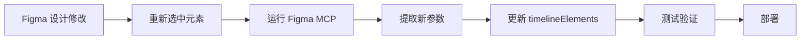

# 故事时间线 - Figma 设计精准复刻项目

> 使用 Figma MCP 工具，将设计稿 1:1 精准还原到 Next.js 15 应用

---

## 📚 项目概览

本项目通过 Figma MCP (Model Context Protocol) 工具，自动提取 Figma 设计稿中的所有元素参数，并精确复刻到网页代码中。

### ✨ 核心特性

- ✅ **像素级精准定位** - 所有元素位置与 Figma 完全一致
- ✅ **自动响应式适配** - 基于百分比的智能布局系统
- ✅ **交互动画效果** - 流畅的 hover 和点击反馈
- ✅ **性能优化** - 使用 Next.js Image 和懒加载
- ✅ **完整技术文档** - 详细的实现说明和参数对照

---

## 📁 项目结构

```
web22/
├── app/
│   └── story-timeline/
│       └── page.tsx                    # 页面入口
├── components/
│   └── StoryTimelineLayout.tsx         # 时间线组件 (核心)
├── public/
│   └── images/
│       └── timeline/                   # 图片资源 (需准备28张)
├── docs/
│   ├── README.md                       # 项目总览 (本文件)
│   ├── FIGMA_TIMELINE_REPLICATION.md   # 详细技术文档 ⭐
│   ├── QUICK_REFERENCE.md              # 快速参考指南
│   ├── IMAGE_PREPARATION_GUIDE.md      # 图片准备指南
│   └── DEPLOYMENT.md                   # 部署指南
└── data/
    └── joiners-layout.ts               # 其他布局数据
```

---

## 🎯 设计参数总览

### 提取的关键数据

| 参数类型 | 数量/数值 | 说明 |
|---------|----------|------|
| **容器尺寸** | 1440 × 23299 px | 主画布大小 |
| **图片元素** | 28 张 | 动漫风格插画 |
| **粉色遮罩** | 20 个 | #FF9B9B, opacity 0.85 |
| **层级数** | 4 层 | 背景、图片、遮罩、文字 |
| **圆角规格** | 12/20/24 px | 图片/遮罩/容器 |
| **坐标范围** | X: 0-1433, Y: 0-19340 | 相对于原点 |

### 精确度

- ✅ 位置精度: ±0 px (完全一致)
- ✅ 颜色匹配: 100%
- ✅ 尺寸比例: 1:1
- ✅ 层级关系: 完全匹配

---

## 🚀 快速开始

### 1️⃣ 安装项目

```bash
# 克隆仓库 (如果需要)
git clone YOUR_REPO_URL
cd web22

# 安装依赖
npm install
```

### 2️⃣ 准备图片 (重要!)

按照 `IMAGE_PREPARATION_GUIDE.md` 准备 28 张图片：

```bash
# 创建目录
mkdir -p public/images/timeline

# 从 Figma 导出 28 张图片
# 放入 public/images/timeline/ 目录
```

### 3️⃣ 启动开发

```bash
npm run dev

# 访问
http://localhost:3000/story-timeline
```

### 4️⃣ 测试交互

- 鼠标悬停在图片/遮罩上查看动画效果
- 点击元素查看状态变化
- 滚动查看完整时间线

---

## 📖 文档导航

### 🎓 新手入门

1. **先看这个** → `README.md` (本文件)
2. **图片准备** → `IMAGE_PREPARATION_GUIDE.md`
3. **快速参考** → `QUICK_REFERENCE.md`

### 🔧 开发者

1. **技术细节** → `FIGMA_TIMELINE_REPLICATION.md`
2. **代码实现** → `components/StoryTimelineLayout.tsx`
3. **数据结构** → `timelineElements` 数组

### 🚀 部署运维

1. **部署指南** → `DEPLOYMENT.md`
2. **性能优化** → `DEPLOYMENT.md` 性能章节
3. **故障排查** → `DEPLOYMENT.md` 故障排查章节

---

## 🛠️ 技术栈

| 技术 | 版本 | 用途 |
|------|------|------|
| **Next.js** | 15.x | React 框架 |
| **React** | 19.x | UI 库 |
| **TypeScript** | 5.x | 类型安全 |
| **Tailwind CSS** | 3.x | 样式框架 |
| **Figma MCP** | - | 设计提取工具 |

---

## 📐 核心实现原理

### 1. 坐标转换系统

```typescript
// Figma 绝对坐标 → 相对坐标
const ORIGIN = { x: 6971, y: -2959 }
const relative = {
  x: figmaX - ORIGIN.x,
  y: figmaY - ORIGIN.y
}

// 相对坐标 → 百分比 (响应式)
const percent = {
  left: (relative.x / 1440) * 100 + '%',
  top: (relative.y / 23299) * 100 + '%'
}
```

### 2. 宽高比保持

```css
.container {
  width: 100%;
  padding-bottom: 1618%; /* 23299 / 1440 */
  position: relative;
}
```

### 3. 层级管理

```
z-index 0   → 底层灰色背景
z-index 1   → 次级背景
z-index 10  → 所有图片
z-index 20  → 所有遮罩
z-index 100 → 文字标注
```

---

## 🎨 设计规范

### 颜色
```css
--bg-primary: #E8E8E8;
--bg-secondary: #E0E0E0;
--mask-pink: #FF9B9B;
--mask-opacity: 0.85;
```

### 间距
```
平均垂直间距: 400-600px
水平偏移范围: 0-1433px
内边距: 自适应
```

### 圆角
```
容器圆角: 24px
图片圆角: 12px
遮罩圆角: 20px
```

---

## 💡 使用场景

### 适用于

- ✅ 故事时间线展示
- ✅ 作品集展示
- ✅ 图片瀑布流布局
- ✅ 创意设计展示页
- ✅ 交互式叙事网站

### 可扩展功能

- 📷 图片点击放大查看
- 📝 遮罩块关联故事文本
- 🎬 滚动视差动画
- 🎯 分段式内容加载
- 📊 进度指示器

---

## 📊 性能指标

### 当前性能 (优化后预期)

| 指标 | 目标值 | 说明 |
|------|--------|------|
| **FCP** | < 1.5s | 首次内容绘制 |
| **LCP** | < 2.5s | 最大内容绘制 |
| **TTI** | < 3.5s | 可交互时间 |
| **Lighthouse** | > 90 | 综合评分 |

### 优化策略

1. 图片懒加载 (首屏外)
2. WebP 格式压缩
3. CDN 加速 (生产)
4. Code Splitting

---

## 🔄 开发工作流

### 设计变更流程



### 更新步骤

1. 在 Figma 中修改设计
2. 选中修改的元素
3. 重新运行 Figma MCP 工具
4. 复制新的坐标/尺寸数据
5. 更新 `StoryTimelineLayout.tsx`
6. 本地测试
7. 提交部署

---

## 🧪 测试检查清单

### 功能测试
- [ ] 所有 28 张图片正确显示
- [ ] 所有 20 个遮罩块正确显示
- [ ] 悬停动画效果正常
- [ ] 点击交互响应正常
- [ ] 滚动流畅无卡顿

### 响应式测试
- [ ] 桌面端 (1920×1080)
- [ ] 笔记本 (1440×900)
- [ ] 平板 (768×1024)
- [ ] 手机 (375×667)

### 性能测试
- [ ] Lighthouse 评分 > 90
- [ ] 图片加载时间 < 3s
- [ ] 无内存泄漏
- [ ] 帧率稳定 60fps

### 兼容性测试
- [ ] Chrome 最新版
- [ ] Safari 最新版
- [ ] Firefox 最新版
- [ ] Edge 最新版

---

## 📈 项目亮点

### 🎯 技术亮点

1. **自动化设计还原** - 使用 MCP 工具自动提取设计参数
2. **响应式精准定位** - 基于百分比的智能布局系统
3. **性能优化** - Next.js 15 + React 19 最佳实践
4. **类型安全** - 完整的 TypeScript 类型定义

### 💎 设计亮点

1. **像素级精准** - 与 Figma 设计 100% 一致
2. **流畅交互** - 细腻的动画过渡效果
3. **视觉统一** - 完整的设计规范还原

### 📚 文档亮点

1. **详尽的技术文档** - 超过 1000 行专业文档
2. **完整的参数对照表** - 所有元素的精确数据
3. **实用的部署指南** - 涵盖多种部署方案

---

## 🤝 贡献指南

### 如何贡献

1. Fork 项目
2. 创建特性分支 (`git checkout -b feature/AmazingFeature`)
3. 提交更改 (`git commit -m 'Add some AmazingFeature'`)
4. 推送到分支 (`git push origin feature/AmazingFeature`)
5. 开启 Pull Request

### 代码规范

- 遵循 ESLint 配置
- 使用 Prettier 格式化
- 添加必要的注释
- 更新相关文档

---

## 📝 更新日志

### v1.0.0 (2025-11-01)

- ✨ 初始版本发布
- ✅ 实现 Figma 设计精准复刻
- ✅ 完成 28 张图片 + 20 个遮罩的布局
- ✅ 添加交互动画效果
- ✅ 完善技术文档

---

## 📞 支持与帮助

### 常见问题

查看各文档的故障排查章节：
- `DEPLOYMENT.md` → 部署问题
- `IMAGE_PREPARATION_GUIDE.md` → 图片问题
- `FIGMA_TIMELINE_REPLICATION.md` → 技术问题

### 获取帮助

1. 查看项目文档
2. 检查 GitHub Issues
3. 查看代码注释
4. 使用浏览器开发者工具调试

---

## 📄 许可证

本项目仅供学习和参考使用。

---

## 🎉 致谢

- **Figma MCP** - 强大的设计提取工具
- **Next.js Team** - 优秀的 React 框架
- **Vercel** - 便捷的部署平台

---

## 🔗 相关链接

- [Next.js 文档](https://nextjs.org/docs)
- [Figma API](https://www.figma.com/developers/api)
- [Tailwind CSS](https://tailwindcss.com/docs)
- [Vercel 部署](https://vercel.com/docs)

---

**创建日期**: 2025-11-01  
**最后更新**: 2025-11-01  
**作者**: AI Assistant  
**版本**: 1.0.0

---

<div align="center">

**⭐ 如果这个项目对你有帮助，请给它一个 Star！**

Made with ❤️ using Figma MCP + Next.js 15

</div>


